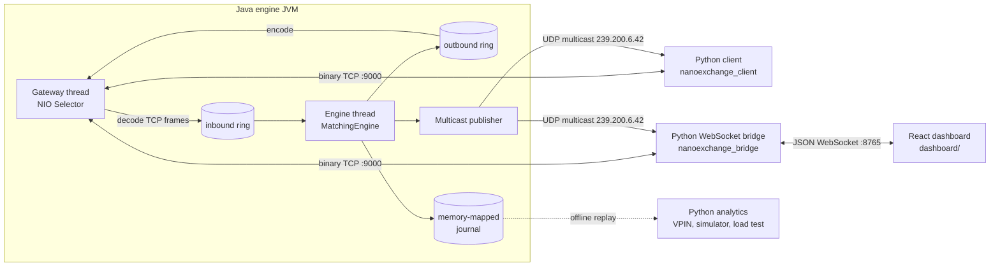

# NanoExchange

A zero-allocation matching engine and full-stack exchange simulator, from
byte-level wire protocols to a 60 fps React dashboard.

**Java 21 · Python · React 18 · TypeScript · Tailwind · UDP multicast · JMH**


Live dashboard under the random-order simulator: free-floating Order Book, OHLC Price chart
with 3s/10s/1m/3m timeframes, Order Entry, Depth heatmap, Trade tape, Metrics, and Latency
monitor. Three themes in the top-right toggle: dark, light, and a
colorblind-safe palette (blue/orange in place of green/red). Deep dives in
[`docs/ARCHITECTURE.md`](docs/ARCHITECTURE.md) (processes, threads, memory model),
[`docs/PROTOCOL.md`](docs/PROTOCOL.md) (byte-level wire formats),
[`docs/PERFORMANCE.md`](docs/PERFORMANCE.md) (benchmark methodology and results), and
[`docs/DECISIONS.md`](docs/DECISIONS.md) (20 ADRs).

---

## What it is

NanoExchange is a self-contained, CLOB-style matching engine with the full infrastructure
that would surround one in production: a binary TCP order gateway, a UDP multicast market-data
feed with snapshot + incremental recovery, a deterministic memory-mapped journal, a Python
client library, a WebSocket bridge, a real-time React UI, and JMH benchmarks that quantify
every layer.

The matching engine holds zero allocations on its hot path after warmup, across all supported
order types (LIMIT, MARKET, IOC, FOK, ICEBERG), verified with JMH `-prof gc`. The ring buffer
outperforms `ArrayBlockingQueue` by ~1.3×. The dashboard stays at 60 fps while processing
10 k market-data messages per second because every incoming WebSocket message is drained
inside a single `requestAnimationFrame`, not on arrival.

## Architecture



Three processes. Two wire protocols (binary TCP for order entry, UDP multicast for market
data). One JSON envelope for the browser. The component-level diagrams live in
[`docs/ARCHITECTURE.md`](docs/ARCHITECTURE.md); the byte-level layouts live in
[`docs/PROTOCOL.md`](docs/PROTOCOL.md).

## Measured performance

Numbers are per-component, not end-to-end. The 10 k figure is the dashboard/bridge
ceiling; the engine is three orders of magnitude higher.

| Component                              | Metric                      | Result                |
|----------------------------------------|-----------------------------|-----------------------|
| `MatchingEngine.process` resting limit | throughput                  | **33.9 M ops/s**      |
|                                        | latency / op                | 29.5 ns               |
|                                        | allocation                  | 0 B/op after warmup   |
| `MatchingEngine.process` 5-level sweep | throughput                  | 6.5 M ops/s           |
|                                        | latency / op                | 155 ns                |
| `RingBuffer` SPSC hand-off             | throughput                  | 58 M ops/s            |
|                                        | vs `ArrayBlockingQueue`     | ~1.3× faster, ~4× less variance |
| `WireCodec` NEW_ORDER encode           | throughput                  | 28.6 M ops/s (35 ns)  |
| `WireCodec` NEW_ORDER decode           | throughput                  | 27.9 M ops/s          |
| Dashboard under 10 k msg/s load        | frame rate                  | **60.0 fps sustained**|
|                                        | p99 frame time              | 17.8 ms               |
|                                        | longest task                | 42 ms                 |

Apple M5 · JDK 21.0.10 · macOS 26.1 · JMH 1.37 default config. Methodology, flamegraph
pointers, and interpretation notes in [`docs/PERFORMANCE.md`](docs/PERFORMANCE.md).

## What makes this stand out

- **Zero-allocation hot path, end-to-end.** Pooled orders, pooled execution reports, a
  length-prefix codec that writes into a pre-sized `ByteBuffer`, and a `LongHashMap` keyed by
  primitive `long` so order-ID lookups never box. JMH `-prof gc` is the contract, not an
  afterthought.
- **Deterministic replay.** Every input event and every emitted report is journaled to a
  memory-mapped file framed with CRC32. Replaying the file into a fresh engine reproduces
  the output stream byte-for-byte, which is how the restart test proves the engine is
  deterministic ([ADR-008](docs/DECISIONS.md#adr-008-memory-mapped-append-only-journal)).
- **Real wire protocols, documented to the byte.** Little-endian, length-prefix-framed,
  CRC-checked binary TCP for order entry. UDP multicast with monotonic sequence numbers and
  snapshot + incremental recovery for market data. Both specified in
  [`docs/PROTOCOL.md`](docs/PROTOCOL.md) with hex examples, not English.
- **Frame-accurate dashboard instrumentation.** Incoming WebSocket messages are not
  dispatched to React on arrival; they are queued and drained inside a single
  `requestAnimationFrame` per tick
  ([ADR-016](docs/DECISIONS.md#adr-016-dashboard-dispatches-websocket-messages-inside-a-single-requestanimationframe-not-on-arrival)).
  Frame metrics use `useSyncExternalStore` so the LatencyMonitor re-renders at 1 Hz while
  the rest of the UI re-renders at 60 Hz
  ([ADR-018](docs/DECISIONS.md#adr-018-frame-rate-instrumentation-via-usesyncexternalstore-virtualisation-by-level-count)).
- **Analytics worth running.** A Python analytics package computes VPIN (Easley / López de
  Prado / O'Hara, 2012) off the journal, renders a latency histogram and depth heatmap, and
  includes a market-making simulator that drives the live engine via the TCP gateway. See
  `make analytics`.

## Quick start

Prerequisites: Python ≥ 3.11 and Node ≥ 20. JDK 21 is fetched automatically by the
Gradle wrapper via the foojay resolver.

```bash
git clone https://github.com/qflen/NanoExchange.git && cd NanoExchange
./run.sh
```

First run auto-bootstraps the Python venv and dashboard npm packages, builds the
engine, then starts all three processes. Open http://localhost:5173. Ctrl-C tears
everything down. `./run.sh --help` explains each piece.

To run the full test suite across Java, Python, and the dashboard:

```bash
./gradlew check
.venv/bin/pytest client/tests bridge/tests analytics/tests
npm --prefix dashboard test -- --run
```

`docker compose up` is the alternative for CI-style reproducibility: see the
[Docker notes](#docker-notes) for multicast caveats.

## Layout

```
engine/                 Java: pooled order book, matching engine, ring buffer, journal
network/                Java: TCP order gateway + UDP multicast publisher + binary codecs
bench/                  Java: JMH benchmarks (headline numbers live here)
client/                 Python: TCP order client + UDP feed handler + book builder
analytics/              Python: VPIN, latency histograms, market-maker simulator
bridge/                 Python: UDP/TCP ↔ WebSocket with per-client rAF-window batching
dashboard/              React 18 + TypeScript + Tailwind: the live UI
docs/
├── ARCHITECTURE.md     process + thread + memory model
├── BUILD_PLAN.md       execution plan and order-of-construction
├── DECISIONS.md        20 ADRs: every non-obvious call made in this repo
├── PERFORMANCE.md      benchmark methodology, results, flamegraph pointers
├── PROTOCOL.md         wire + journal + feed formats, byte-level
└── screenshots/
```

## Docker notes

`docker compose up` builds and starts three containers: `engine`, `bridge`, and `dashboard`
(nginx-served static build). The engine and bridge run with `network_mode: host` on Linux because
UDP multicast inside a user-defined bridge network is flaky and the loopback-interface dance
that macOS needs does not translate cleanly to Docker. On macOS, Docker Desktop's VM does
not forward multicast at all; run the engine and bridge natively (or in a Linux VM) and keep
`docker compose` for CI-style reproducibility.

## CI

GitHub Actions runs on every push and PR:

- `java`: `./gradlew check` with a cached `~/.gradle`
- `python`: `pytest` across `client/`, `bridge/`, and `analytics/` with a cached `pip` dir
- `dashboard`: `vitest run` and `vite build` with a cached `node_modules`

Benchmarks (`./gradlew :bench:jmh`) are not run in CI: they are noisy on shared hardware
and the numbers in [`docs/PERFORMANCE.md`](docs/PERFORMANCE.md) come from a controlled
machine. Nightly benchmark runs are in the backlog.

## Tradeoffs & future work

- **The price-level container is still a sorted array.** ADR-005 pins this as a deliberate
  tradeoff for shallow books; the JMH numbers agreed when I measured it. The first time I
  profile a thousand-level book under realistic cancel churn I expect a B-tree-of-arrays to
  beat it, and the replay machinery makes the swap safe. It is in the backlog, not shipped.
- **MPSC ring buffer.** The current SPSC hand-off is fine for one gateway thread, but the
  moment a second matching engine (different instrument) appears, the gateway wants to fan
  out. MPSC with a claim strategy is half a day of work; it is in the backlog because this
  build did not need it.
- **Cross-language protocol test.** Python's `struct` layouts and Java's `ByteBuffer` calls
  agree today because I wrote them both and PROTOCOL.md is the source of truth. A
  byte-for-byte round-trip test that generates frames from both stacks would catch silent
  drift. In the backlog.
- **Playwright E2E.** Vitest covers the components; a Playwright run that submits an order
  and asserts the exec-report lands in the Open Orders table would be the last mile. Out of
  scope here.

## License

MIT
